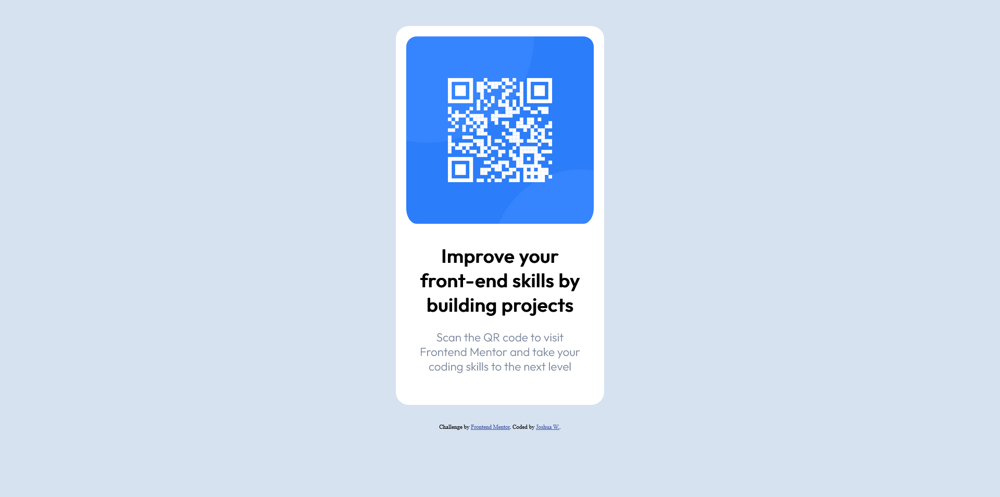
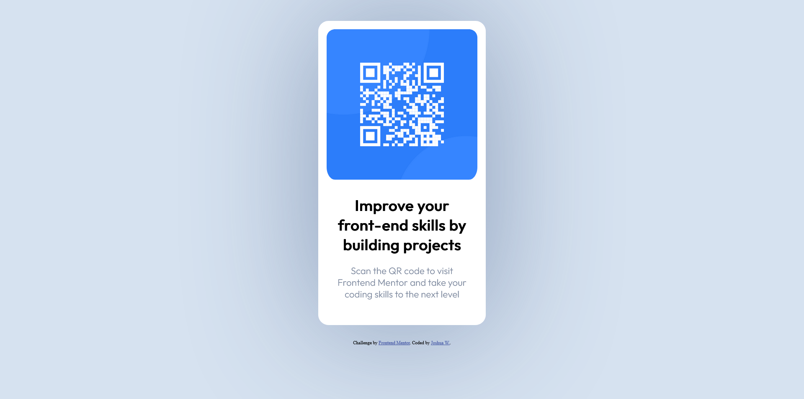

# Frontend Mentor - QR code component solution

This is a solution to the [QR code component challenge on Frontend Mentor](https://www.frontendmentor.io/challenges/qr-code-component-iux_sIO_H). Frontend Mentor challenges help you improve your coding skills by building realistic projects. 

## Table of contents

- [Overview](#overview)
  - [Screenshot](#screenshot)
- [My process](#my-process)
  - [Built with](#built-with)
  - [What I learned](#what-i-learned)
  - [Useful resources](#useful-resources)
- [Author](#author)
- [Acknowledgments](#acknowledgments)

## Overview

This is my version of the QR code card, with a ease transition when the cursor hovers over the card.

### Screenshot

Below is a screenshot of my qr code card


Below is a screenshot of my qr code card with the transition hover on.


## My process

This was simple. Created the QR code container first so it could fit all of the content, then added and styled all of the content.

### Built with

- Semantic HTML5 markup
- CSS custom properties

### What I learned

What I enjoyed learning most was adding the transition to the container (below)
```html
<div class="container">
```
I had to research how to use transition, as it wasn't working at first. I had to put two transitions to make the box-shadow appear and disappear smoothly.

Below are the two transitions I used for the container without being hovered over and being hovered by the cursor.
```css
.container {
transition: ease-out 0.7s;
}

.container:hover {
    transition: ease-in 0.6s;
    box-shadow: 0px 3px 500px 5px hsla(217, 41%, 35%, 0.463);
}
```

### Useful resources

- [MDN web doc - Using CSS transitions](https://developer.mozilla.org/en-US/docs/Web/CSS/CSS_Transitions/Using_CSS_transitions) - This helped me understand transitions.

## Author

- Git - [Joshua](https://github.com/J-Wil21)
- Frontend Mentor - [@J-Wil21](https://www.twitter.com/J-Wil21)

## Acknowledgments

Just want to take this opportunity to say a thank you to Lucas on frontend Mentor at [@correlucas](https://www.frontendmentor.io/profile/correlucas) for giving me the idea of the transition with his card component [Check it out](https://product-preview-card-component-two.vercel.app/) 
